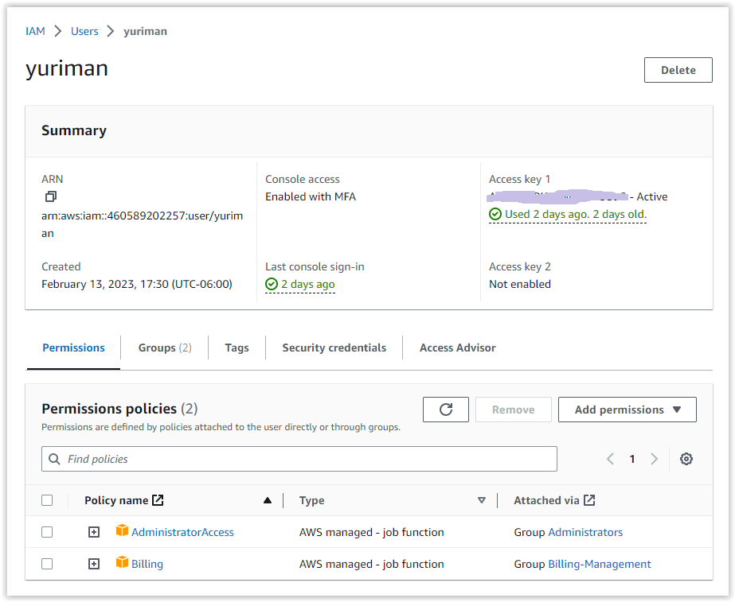
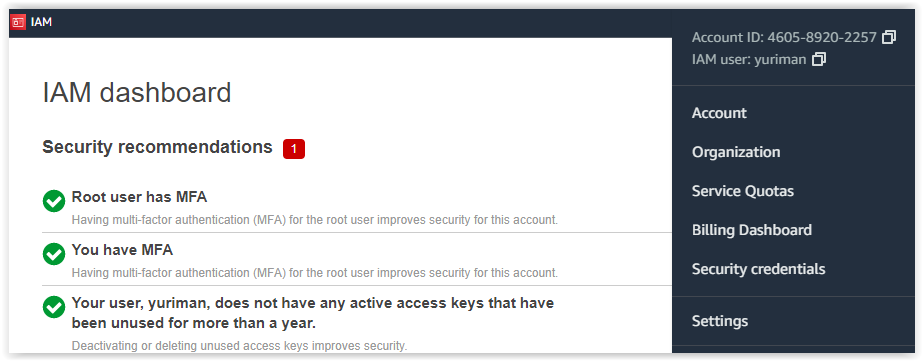
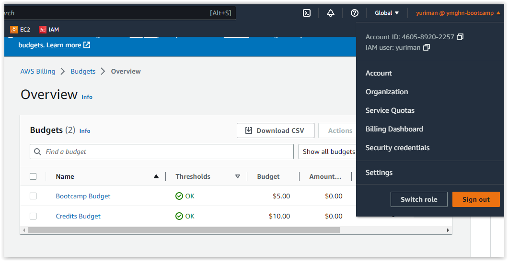
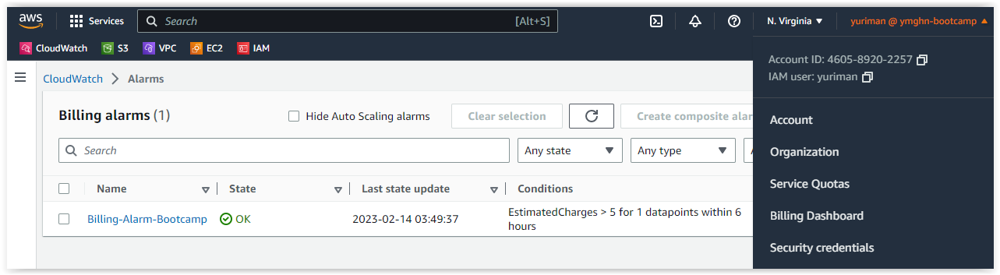

# Week 0 — Billing and Architecture

So, before I begin I like to thanks Andrew Brown and the team for this great opportunity to learn AWS stuff.

I just finish the additional video for setting up Credentials, using AWS CLI, and the Billing and budget settings.

Before I start creating credentials, I read some tips posted on https://www.linuxtek.ca/2023/02/12/aws-cloud-project-bootcamp-week-0-unofficial-homework-guide/. It was of help for me because I already had an account for about 9 month now, which I used for study and pass the Cloud Practitioner Exam. I Created an organization and added a new account with my gmail+thing email address. I also already had a Domain registered with Route 53 that I'm going to use for this bootcamp.

## Back to my learning

So far what I have done is:
1. I went and create a user with admin and billing permissions, secure it with [MFA Authy app](https://authy.com/). Its a great soft MFA service where you can have many accounts from different sites
2. For the billing part. I created using the GUI, but I also try the AWS CLI, with the json files on gitpod. I had some trouble at first with the syntax. Im not familiar with json files, but I created a budget and then delete it :-) 
3. For the architectural design. I Use Lucidchart as instructured. I think it's easy to use and it's great that there are shape libraries for popular platforms like AWS. In the past I use Microsoft Visio and sometimes it was a little pain to import shapes and icons. So, this is really cool.

## Required Homework

### Admin user and secure account with MFA

I created a IAM user with admin and billing priviledges using the built-in policies: 
+ **AdministratorAccess**, which provides full access to AWS services
+ **Billing**, which grants permissions for billing and cost management

My admin IAM user is call **yuriman**. It's my nickname from college 🙂

I also secure it with a virtual MFA call [**Authy**](https://authy.com/). It's simple and user friendly MFA app.

### Install AWS CLI

I didn't have any problems with it, just running fine. Here is the link to my [gitpod.yml](https://github.com/ymendozahn/aws-bootcamp-cruddur-2023/blob/61318ab0f599c0c6181d7959c2ed7f68e0c1a3a3/.gitpod.yml#L1-L10) file 

### Conceptual and Logical Diagram

Here is my **Conceptual Design**. I didn't have a napkin but I use a paper towel during my lunch break. It's a little mess but the idea is there. 

Here is the link for lucidchart: [Conceptual Design](https://lucid.app/lucidchart/bfaf1319-01ed-4481-acee-d43a7c027719/edit?viewport_loc=-89%2C182%2C2048%2C962%2C0_0&invitationId=inv_993eed86-c418-4e16-a966-9d5a596c266b)

And here is my **Logical Design**. I know it's the same as the example, but, maybe I can modified later as we advance with the bootcamp.

Here is the link for lucidchart: [Logical Design](https://lucid.app/lucidchart/ddfaf6f2-74a7-4d74-91a1-332448b12aae/edit?viewport_loc=-130%2C-13%2C2131%2C827%2CcbsxpdK4zMIe&invitationId=inv_9ca2c4c2-859f-49db-a63a-b4be8b03ac79)

### Budget

I created 2 Budgets. One Budget for 5 USD per month. The other one for the Credits. Off course I have to get some credits to see some results 🙂. Anyway I used the GUI for that.

Here are my budgets

 

### Billing Alarm

For the Billing Alarm, I choose a estimate charge of 5 USD. I think I'm going to lower the ammount just to test it.

## Homework Challenge

### Service Limits

I search for the Free tier service limits on AWS services (US East Region) I'm going to use for the project. I'll going to updated it as we advance with the bootcamp. Remember you can use [AWS pricing calculator](https://calculator.aws/) for a better estimated on the costs.

 | AWS Service | Free Tier per month limit | Basic Pricing |
 | ----------- | ------------------------- | ------------- |
 | AppSync     | 250,000 query or data modification operations   250,000 real-time updates   600,000 connection-minutes | pricing is base on instance type and other factors. Details here |
 | CloudFormation | 1,000 handler operations per month per account | Handler operation: $0.0009 per handler operation   Handler operation duration: $0.00008 per second |
 | CloudFront | 1 TB of Data Transfer Out   10,000,000 HTTP or HTTPS Requests   2,000,000 CloudFront Function Invocations | base on various factor. [Details here](https://aws.amazon.com/cloudfront/pricing/) |
 | CloudTrail | 1 Free - Set up a trail that delivers a single copy of management events. | Management events delivered to Amazon S3   $2.00 per 100,000 management events delivered    Data events delivered to Amazon S3   $0.10 per 100,000 data events delivered    CloudTrail Insights   $0.35 per 100,000 events analyzed |
 | CloudWatch | 10 custom metrics and alarms   3 Dashboards with up to 50 Metrics Each | a little complex, but for reference in the US East Region: First 10,000 metrics: $0.30 per month [Details here](https://aws.amazon.com/cloudwatch/pricing/) |
 | CodeBuild | 100 build minutes per month of build.general1.small compute type usage | AWS CodeBuild offers three compute instance types with different amounts of memory and CPU. Charges vary by the compute instance type that you choose for your build. [Detail here](https://aws.amazon.com/codebuild/pricing/) |
 | CodeCommit | 5 active users per month   50 GB-month of storage per month   10,000 Git requests per month | Each additional active user beyond the first 5 $1.00 per month |
 | CodePipeline | 1 Active Pipeline per month | princing has to be calculated with assistance |
 | Cognito | 50,000 MAUs | 50,001-100,000 (after the 50,000 free tier): $0.0055 per MAU |
 | Dynamo DB | 25GB of storage | too much detail to imput for calculate. [Details here](https://aws.amazon.com/dynamodb/pricing/) |
 | EC2 (Elastic Cloud Computing) | 750 hours per month of Linux, RHEL, or SLES t2.micro or t3.micro instance dependent on region   750 hours per month of Windows t2.micro or t3.micro instance dependent on region | pricing is base on instance type and other factors. [Details here](https://aws.amazon.com/ec2/pricing/) |
 | ECS (Elastic Container Registry) | 500 MB-month of Storage | Storage is $0.10 per GB / month for data stored in private or public repositories. |
 | ELB (Elastic Load Balancer) | 750 Hours per month shared between Classic and Application load balancers   15 GB of data processing for Classic load balancers   15 LCUs for Application load balancers | For Application Load Balancers in the AWS Region:   $0.0225 per Application Load Balancer-hour (or partial hour)   $0.008 per LCU-hour (or partial hour) |
 | **Fargate** | **none** | **it's a little complex. The pricing is calculated base on Compute, OS and storage configuration. [Details here](https://aws.amazon.com/fargate/pricing/).** |
 | Lambda | 1 Million requests | ***x86 Price***: First 6 Billion GB-seconds / month   ***Duration***: $0.0000166667 for every GB-second   ***Requests***: $0.20 per 1M requests |
 | RDS (Relational Database Service) | 750 hours in a db.t2.micro, db.t3.micro, and db.t4g.micro Instances, 20GB of Storage, and 20GB for Backups each month, for one year.| **Amazon Aurora (US East Region)**   ***Storage Rate***: $0.10 per GB-month   ***I/O Rate***: $0.20 per 1 million requests |
 | **Route 53** | **none** | **$0.50 per hosted zone / month for the first 25 hosted zones   $0.10 per hosted zone / month for additional hosted zones    Standard Queries   $0.40 per million queries – first 1 Billion queries / month   $0.20 per million queries – over 1 Billion queries / month** |
 | S3 (Simple Storage Service) | 5 GB of Standard Storage | ***S3 Standard***: First 50TB / month : $0.023 per GB |
 | SNS (Simple Notification Service) | 1 Million publishes   100,000 HTTP/S Deliveries   1,000 Email Deliveries | ***notifications***: $0.50 per million notifications   ***Email/Email-JSON***: $2.00 per 100,000 notifications   ***HTTP/s***: $0.60 per million notifications |
 | SQS (Simple Queue Service) | 1,000,000 Requests | From 1 Million to 100 Billion Requests/Month   Standard Queues (per Million requests): $0.40   FIFO Queues (per Million requests): $0.50 |
 
