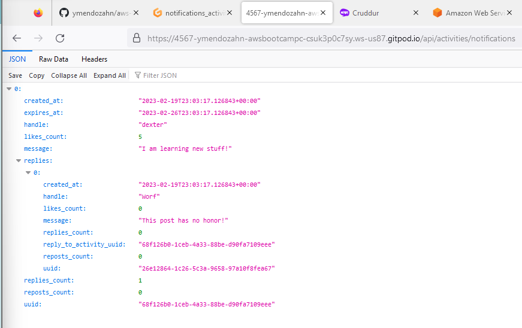

# Week 1 — App Containerization

## Required Homework

### Notification feature on app

So, I follow alone the video for creating the notification feature. I added the npm install to the [gitpod.yml](https://github.com/ymendozahn/aws-bootcamp-cruddur-2023/blob/8000954e6616b8ad3b64e91f6edcb7475ae70599/.gitpod.yml#L11-L12) init section.

I'm not a programmer and my background is basically working with Infrastructure (Servers, Storage, Backups, basic networking, Virtualization).I didn't understand most of the API we edited. So, I had a little problem with identation and syntax errors,but manage to make it work.

#### For the backend

Here is my [notifications_activities.py](https://github.com/ymendozahn/aws-bootcamp-cruddur-2023/blob/main/backend-flask/services/notifications_activities.py) file

Here is my endpoint testing

 

#### For the Frontend

Here is my [NotificationsFeedPage.js](https://github.com/ymendozahn/aws-bootcamp-cruddur-2023/blob/1e83d4d6e791b3b391887db391e919d922dcecbf/frontend-react-js/src/pages/NotificationsFeedPage.js) file

Here is my notifications page working

 
