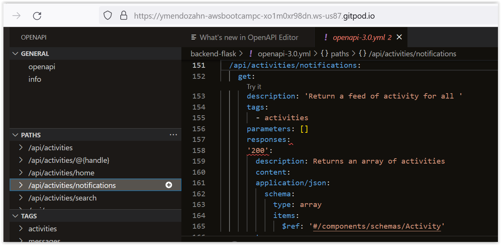
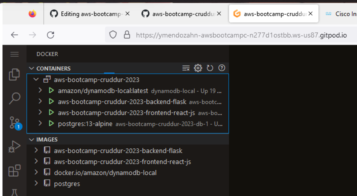
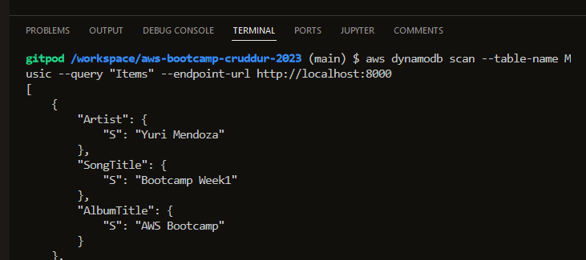
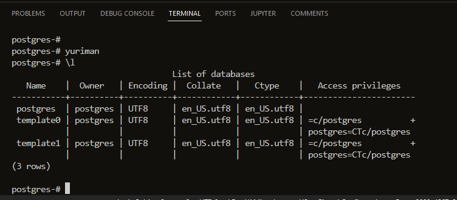
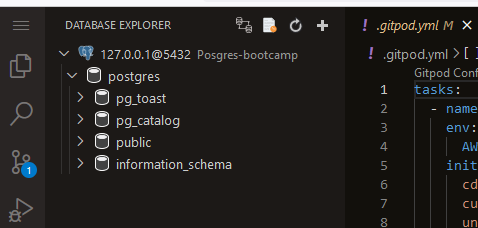
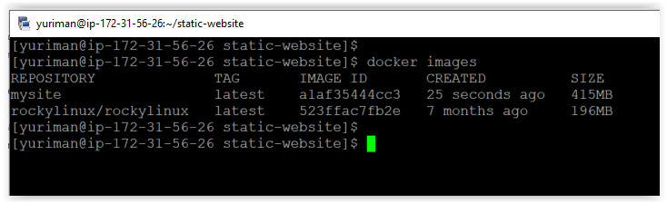
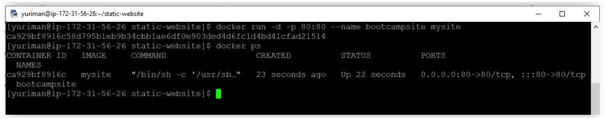
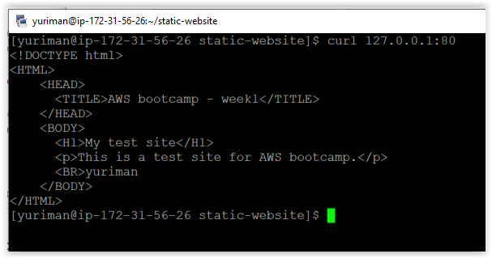
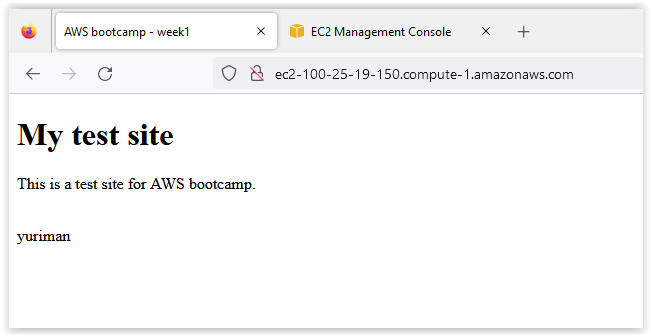

# Week 1 — App Containerization

## Required Homework

### Spending considerations

I understand all the free tier for gitpod and codespaces and I think I'll not surpass the free tier. For the AWS free tier, I have a cloudtrail enable just for the management logs. I made sure to disable data and insights records. 

Here is my cloudtrail configuration


### Security Considerations

What I learned about securing Docker enviroments
+ For the docker host We need to keep it updated with the latest security patches. 
+ We should investigate the source of the public images available before we trust it. 
+ we should use a Secret Management services like AWS Secret Manager or Hashicorp Vault
+ We need to implement application security best practices. Maybe adopt a DevSecOps approach.
+ There is a service call [Synk](https://snyk.io/) which can help us find vulnerabilities on our code, containers and IaC, and automatically fix them. There is a OpenSource and Paid version.
+ there are also services for analyzing vulnerabilities on container images. For AWS we can use AWS Inspector.
+ Overall we need to follow best practices in all the layers on our environments. 

#### Synk configuration for Bootcamp repo

I wanted to try Synk on our bootcamp repository. So I set it up and imported 2 of my repositories, and this is what it found

There are 6 critical issues for the frontend Dockerfile. There are other issues but I'll just review the critical ones.

 

The recommentation is basically do an upgrade of the image. I'm didn't fix it, but I'll try it later.

 

### Notification feature on app

So, I follow alone the video for creating the notification feature. I added the npm install to the [gitpod.yml](https://github.com/ymendozahn/aws-bootcamp-cruddur-2023/blob/8000954e6616b8ad3b64e91f6edcb7475ae70599/.gitpod.yml#L11-L12) init section.

I'm not a programmer and my background is basically working with Infrastructure (Servers, Storage, Backups, basic networking, Virtualization).I didn't understand most of the API we edited. So, I had a little problem with identation and syntax errors,but manage to make it work.

#### Open API

We use the Open API for the endpoint services. We can document the api with readme.io so it can get documented. On the VS Code we can have a extension that helps us to explore the OpenAPI file.

Here is example for the OpenAPI we use for the notifications page

 

#### For the backend

Here is my [notifications_activities.py](https://github.com/ymendozahn/aws-bootcamp-cruddur-2023/blob/main/backend-flask/services/notifications_activities.py) file

Here is my endpoint testing

 

#### For the Frontend

Here is my [NotificationsFeedPage.js](https://github.com/ymendozahn/aws-bootcamp-cruddur-2023/blob/1e83d4d6e791b3b391887db391e919d922dcecbf/frontend-react-js/src/pages/NotificationsFeedPage.js) file

Here is my notifications page working

 
 
 ### Posgres and dynamodb local
 
 So I added to the docker [compose file](https://github.com/ymendozahn/aws-bootcamp-cruddur-2023/blob/9d3f6f86154a65c88b19ad458380b87f137d4487/docker-compose.yml#L20-L53) the posgres and dynamoDB local install code.
 
 Here are my containers running
 
  
 
 Here is my test for the dynamo db record tables
 
  
  
 Here is the test for the Postgres SQL connection
 
  
 
 Here is my database explorer extension working
 
  
  
  Basically I follow along with the instalation and configuration. It's really cool to know that we can easily have a database setup and running with docker containers. 
  
  So, that's about it for this part. 
  
## Homework challenge

### Deploying a EC2 Instance with docker

In summary, I deployed a t2.micro instance and install docker engine. Then, I created a [Dockerfile](https://github.com/ymendozahn/aws-bootcamp-cruddur-2023/blob/b47616808e9469e23736093379aef9cabd75b3ee/journal/assets/Dockerfile) that installs apache2 and copy a basic [index.html](https://github.com/ymendozahn/aws-bootcamp-cruddur-2023/blob/b47616808e9469e23736093379aef9cabd75b3ee/journal/assets/index.html) for testing.
 
 #### Install docker engine in AMI 2 instance
 
 1. update your linux AMI with the latest updates

     `$ sudo yum update `
 2. Install docker engine:

     `$ sudo yum install docker `
 3. Add ec2-user or other to the docker group so you don't have to use `sudo` with every command:

    `$ sudo usermod -a -G docker ec2-user` 
 4. Enable docker service

    `$ sudo systemctl enable docker.engine`
 5. Start docker service

    `$ sudo systemctl start docker.engine`
 6. Verify if docker is running
 
     `$ sudo systemctl status docker.engine`

#### Create dockerfile and deploy the website

 1. make a new dockerfile with the following code:

    ```dockerfile
    FROM rockylinux/rockylinux:latest

    # Install apache2
    RUN yum -y update && \
    yum -y install httpd && \
    yum clean all

    # Copy the basic index file to the container
    COPY index.html /var/www/html/index.html

    # setup port and run apache server
    EXPOSE 80
    ENTRYPOINT /usr/sbin/httpd -DFOREGROUND
    ```
 2. Build the docker image
    
    `$ docker build -t mysite .`
    
    
 3. Run the docker image

    ```
    $ docker run -d -p 80:80 --name bootcampsite mysite
    $ docker ps
    ```
    
    
 4. test the website

    `$ curl 127.0.0.1:80`

    
    
    
    
Well, that's it. It works. Off course remember to open the port 80 on the security group of the EC2 instance, so you can test the site. 
