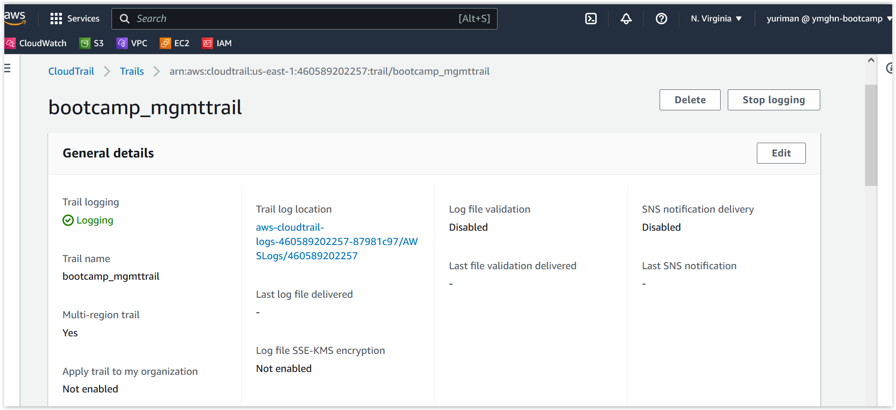

# Week 1 — App Containerization

## Required Homework

### Spending considerations

I understand all the free tier for gitpod and codespaces and I think I'll not surpass the free tier. For the AWS free tier, I have a cloudtrail enable just for the management logs. I made sure to disable data and insights records. 

Here is my cloudtrail configuration

### Security Considerations

What I learned about securing Docker enviroments
+ For the docker host We need to keep it updated with the latest security patches. 
+ We should investigate the source of the public images available before we trust it. 
+ we should use a Secret Management services like AWS Secret Manager or Hashicorp Vault
+ We need to implement application security best practices. Maybe adopt a DevSecOps approach.
+ There is a service call [Synk](https://snyk.io/) which can help us find vulnerabilities on our code, containers and IaC, and automatically fix them. There is a OpenSource and Paid version.
+ there are also services for analyzing vulnerabilities on container images. For AWS we can use AWS Inspector.
+ Overall we need to follow best practices in all the layers on our environments. 

#### Synk configuration for Bootcamp repo

I wanted to try Synk on our bootcamp repository. So I set it up and imported 2 of my repositories, and this is what it found

There are 6 critical issues for the frontend Dockerfile. There are other issues but I'll just review the critical ones.

 

The recommentation is basically do an upgrade of the image. I'm didn't fix it, but I'll try it later.

 

### Notification feature on app

So, I follow alone the video for creating the notification feature. I added the npm install to the [gitpod.yml](https://github.com/ymendozahn/aws-bootcamp-cruddur-2023/blob/8000954e6616b8ad3b64e91f6edcb7475ae70599/.gitpod.yml#L11-L12) init section.

I'm not a programmer and my background is basically working with Infrastructure (Servers, Storage, Backups, basic networking, Virtualization).I didn't understand most of the API we edited. So, I had a little problem with identation and syntax errors,but manage to make it work.

#### For the backend

Here is my [notifications_activities.py](https://github.com/ymendozahn/aws-bootcamp-cruddur-2023/blob/main/backend-flask/services/notifications_activities.py) file

Here is my endpoint testing

 

#### For the Frontend

Here is my [NotificationsFeedPage.js](https://github.com/ymendozahn/aws-bootcamp-cruddur-2023/blob/1e83d4d6e791b3b391887db391e919d922dcecbf/frontend-react-js/src/pages/NotificationsFeedPage.js) file

Here is my notifications page working

 
