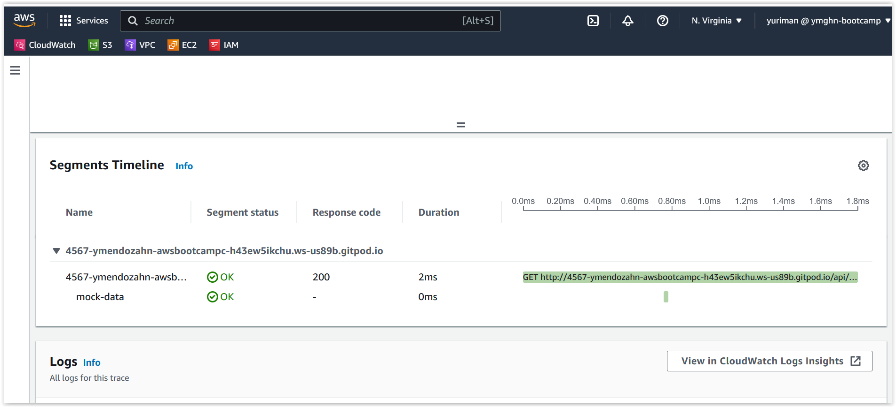
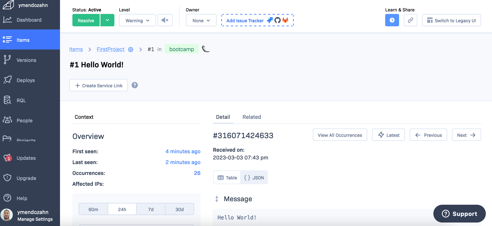
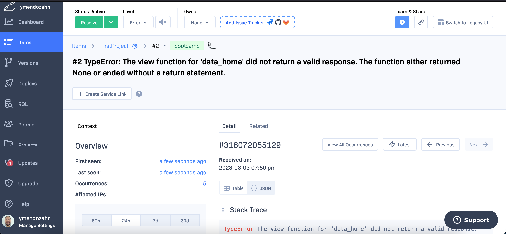
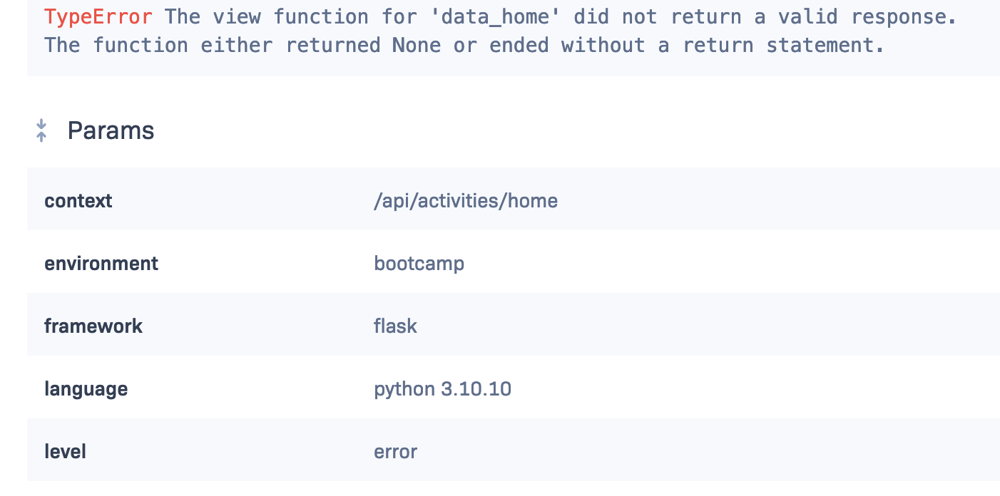

# Week 2 — Distributed Tracing

## Required Homework

### Honeycomb Configuration

I really like honeycomb. It seems it's not that difficult to use. I'll be learning more in the near future. Here are the steps for the instrumentation of Honeycomb

1. In order for honeycomb to collect data, we need to install the opentelemetry packages. We added it to the [requirements.txt](https://github.com/ymendozahn/aws-bootcamp-cruddur-2023/blob/3d030dd41700d91f35d6563cb5e468dbcd0f3403/backend-flask/requirements.txt#L4-L8) file under the backend of the app.
2. Login to the Honeycomb portal: [https://ui.honeycomb.io](https://ui.honeycomb.io/login)
3. Create a new environment for dev/test/prod or even bootcamp :wink: 
4. Setup the **environment variables** for Honeycomb. For the honeycomb API Key, you can get it from the environment you just created for the bootcamp.
 
 

Here are the environment variables you   configure on the [docker-compose](https://github.com/ymendozahn/aws-bootcamp-cruddur-2023/blob/3d030dd41700d91f35d6563cb5e468dbcd0f3403/docker-compose.yml#L7-L10) file: 

```dockerfile
HONEYCOMB_API_KEY: "honeycomb-environment-api-key"
OTEL_EXPORTER_OTLP_ENDPOINT: "https://api.honeycomb.io"
OTEL_EXPORTER_OTLP_HEADERS: "x-honeycomb-team=${HONEYCOMB_API_KEY}"  
OTEL_SERVICE_NAME: "backend-flask"
```

5. Now, we can start instrument with honeycomb. We need to add some code for initialize the traces on the [app.py](https://github.com/ymendozahn/aws-bootcamp-cruddur-2023/blob/3d030dd41700d91f35d6563cb5e468dbcd0f3403/backend-flask/app.py#L17-L24) file.  

```python
...

#####  --- HoneyComb traces --- ####
from opentelemetry import trace
from opentelemetry.instrumentation.flask import FlaskInstrumentor
from opentelemetry.instrumentation.requests import RequestsInstrumentor
from opentelemetry.exporter.otlp.proto.http.trace_exporter import OTLPSpanExporter
from opentelemetry.sdk.trace import TracerProvider
from opentelemetry.sdk.trace.export import BatchSpanProcessor
from opentelemetry.sdk.trace.export import ConsoleSpanExporter, SimpleSpanProcessor

...
```

**NOTE**: there is more code added that you can review on the [app.py](https://github.com/ymendozahn/aws-bootcamp-cruddur-2023/blob/3d030dd41700d91f35d6563cb5e468dbcd0f3403/backend-flask/app.py) file

 

6. Now we can further add more detail info to the span to better understand the trace. Wr can add a hardcode trace within the home page.

On the [home_activities.py](https://github.com/ymendozahn/aws-bootcamp-cruddur-2023/blob/3d030dd41700d91f35d6563cb5e468dbcd0f3403/backend-flask/services/home_activities.py#L8-L11) file we add a span trace to tell what is going on in this part of the app. Here is the code
```python
...
from opentelemetry import trace
...
    with tracer.start_as_current_span("home-activites-test-data"):
      span = trace.get_current_span()
      now = datetime.now(timezone.utc).astimezone()
      span.set_attribute("app.now", now.isoformat())
```

8. Now you can start to look for the trace on the honeycomb portal, and see details of the trace.

 
 
We need to explore more with the span and queries, but basically that's it for now.

### AWS X-RAY configuration

So, I follow the video instructions and here is a summary of the steps

1. We have to import the libraries and start the recorder for the backend-flask
  Here is the code for reference on [app.py](https://github.com/ymendozahn/aws-bootcamp-cruddur-2023/blob/3d030dd41700d91f35d6563cb5e468dbcd0f3403/backend-flask/app.py#L26-L28) file
2. create a AWS X-Ray group in order to filter the traces we want to review.
 
3. do some sample trace with the [xray.json](https://github.com/ymendozahn/aws-bootcamp-cruddur-2023/blob/3d030dd41700d91f35d6563cb5e468dbcd0f3403/aws/json/xray.json) file
4. Now we have to do some instrumentation with xray
  Basically for python we import the xray sdk core library. Then we can start the instrumentation using segments.
  
  ```python 
  from aws_xray_sdk.core import xray_recorder
  ```
  Now we can test traces that are logging into AWS X-ray. Here is an example for the cruddur app
  
   
   
   
  
  Off course this is just the tip of the iceberg. We have to dig deep in order to understand how use it.
   
 ### AWS Cloudwatch logs configuration
 
 So, for the cloudwatch logs here are the steps to get it up and running.

1. We include the **watchtower** module into the backend flask [requirements.txt](https://github.com/ymendozahn/aws-bootcamp-cruddur-2023/blob/6427a6d4e6d7b9c5b499c9572074105f238d0135/backend-flask/requirements.txt#L12) file, in order to get install.
2. We import the libraries and configure the logger on the [app.py](https://github.com/ymendozahn/aws-bootcamp-cruddur-2023/blob/6427a6d4e6d7b9c5b499c9572074105f238d0135/backend-flask/app.py#L30-L33) file.
```python
import watchtower
import logging
from time import strftime

...

LOGGER = logging.getLogger(__name__)
LOGGER.setLevel(logging.DEBUG)
console_handler = logging.StreamHandler()
cw_handler = watchtower.CloudWatchLogHandler(log_group='cruddur')
LOGGER.addHandler(console_handler)
LOGGER.addHandler(cw_handler)
LOGGER.info("Starting logging Backend app")
```

3. Now we can log some info on the endpoint. Here is the logging for [home.activities.py](https://github.com/ymendozahn/aws-bootcamp-cruddur-2023/blob/6427a6d4e6d7b9c5b499c9572074105f238d0135/backend-flask/services/home_activities.py#L8) file

```python
logger.info("HomeActivities")
```
4. Also, we have to add some environment variables to the backend part of the [docker-compose](https://github.com/ymendozahn/aws-bootcamp-cruddur-2023/blob/6427a6d4e6d7b9c5b499c9572074105f238d0135/docker-compose.yml#L13-L15) file.

```dockerfile
AWS_DEFAULT_REGION: "${AWS_DEFAULT_REGION}"
AWS_ACCESS_KEY_ID: "${AWS_ACCESS_KEY_ID}"
AWS_SECRET_ACCESS_KEY: "${AWS_SECRET_ACCESS_KEY}"
```
5. Here are my logs registering on the group for the app.

 
 
 
 
6. To be able to use **subsegments** we have to begin (inicialize) and then end (close) the subsegment. We implemented on the [user activities](https://github.com/ymendozahn/aws-bootcamp-cruddur-2023/blob/509ea42aaf7be0889d98279503c5f0d341b4a020/backend-flask/services/user_activities.py#L29-L40) page. 

here is the logging.

 
 
 So, that's it. 
 
 ### Rollbar configuration
 
 Ok, here are the step in order to trace error with rollbar.
 
 1. install the rollbar libraries to the backend by adding **rollbar** packages to the [requirements.txt](https://github.com/ymendozahn/aws-bootcamp-cruddur-2023/blob/6762ca03a676902329d3bf9fb94668c2937f3525/backend-flask/requirements.txt#L14-L15) file.

2. We need to have a account in the Rollbar site and setup the SDK for flask. In order to send information to Rollbar, we add the some environment variables to the [docker-compose](https://github.com/ymendozahn/aws-bootcamp-cruddur-2023/blob/6762ca03a676902329d3bf9fb94668c2937f3525/docker-compose.yml#L16) file. **NOTE: the access token is on the setup page from the rollbar site.**

 ```dockerfile
 ROLLBAR_ACCESS_TOKEN: "my-rollbar-access-token"
 ```
 
 3. Now we need to import and initialize the rollbar libraries on the [app.py](https://github.com/ymendozahn/aws-bootcamp-cruddur-2023/blob/6762ca03a676902329d3bf9fb94668c2937f3525/backend-flask/app.py#L35-L40) file of the backend app.

```python
from time import strftime
import os
import rollbar
import rollbar.contrib.flask
from flask import got_request_exception

...

# Rollbar ----------
rollbar_access_token = os.getenv('ROLLBAR_ACCESS_TOKEN')
@app.before_first_request
def init_rollbar():
    """init rollbar module"""
    rollbar.init(
        # access token
        rollbar_access_token,
        # environment name
        'production',
        # server root directory, makes tracebacks prettier
        root=os.path.dirname(os.path.realpath(__file__)),
        # flask already sets up logging
        allow_logging_basic_config=False)

    # send exceptions from `app` to rollbar, using flask's signal system.
    got_request_exception.connect(rollbar.contrib.flask.report_exception, app)

```
4. In order to test we are going to have a new endpoint added to the [app.py](https://github.com/ymendozahn/aws-bootcamp-cruddur-2023/blob/6762ca03a676902329d3bf9fb94668c2937f3525/backend-flask/app.py#L114-L117) file

```python
@app.route('/rollbar/test')
def rollbar_test():
    rollbar.report_message('Hello World!', 'warning')
    return "Hello World!"
```
5. Ok so now we can go to the rollbar portal see what was logged.

 

6. So, now we are going to create a code error to the home activities page. Here is the error.

 
 
 
 
And that's it. 

thanks 🌝
