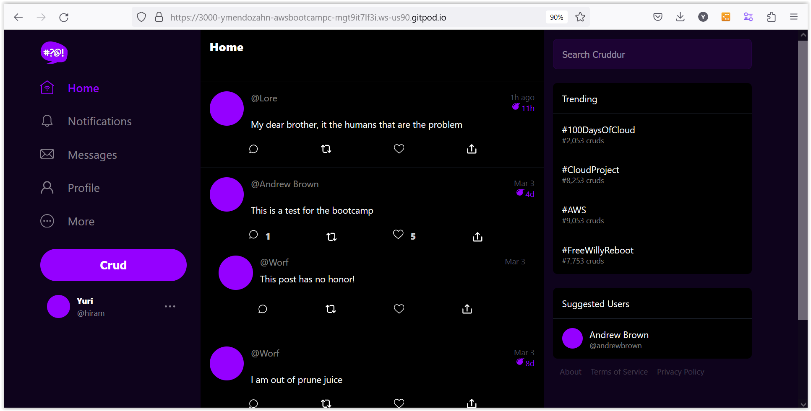

# Week 3 — Decentralized Authentication

## Amazon Cognito

This is a service that is use for the configuration of a secure identity and access management.

We need to setup Amazon Cognito. There are 6 steps for the configuration of the pool. Here are some tips for testing Amazon Cognito

1. do not use the Hosted UI. It's better to provide your own.
2. To limit the costs, use only email registration and confirmation. Also leave the MFA uncheck.
3. for the required attributes we are going to choose **name** and **preffered_username**.
4. Choose Cognito for the email provider, this will save you some money.
5. Remember to select only one option for the Cognito user pool sign-in. We use only **email**. 


### Configuring Amazon Cognito

After we have the Cognito user pool setup. We need to configure it on the frontend part of the app. Here are the steps:

1. Install the amplify libraries on the for the frontend. just run the following command inside the frontend-react folder. The `--save` options add the Amplify library into the [package.json](https://github.com/ymendozahn/aws-bootcamp-cruddur-2023/blob/faf333eae4e43ae495ca183ac9a6c4092efed011/frontend-react-js/package.json#L9) file

```
$npm install aws-amplify --save
```
2. We need to import the aws-amplify library on the [app.js](https://github.com/ymendozahn/aws-bootcamp-cruddur-2023/blob/faf333eae4e43ae495ca183ac9a6c4092efed011/frontend-react-js/src/App.js#L14) file and on every frontend pages that we are integrating cognito authentication.   
    
3. On the [app.js](https://github.com/ymendozahn/aws-bootcamp-cruddur-2023/blob/faf333eae4e43ae495ca183ac9a6c4092efed011/frontend-react-js/src/App.js#L24-L27) we setup environment variables in order to use the cognito user pool we created earlier. Here is the code.

```javascript
  "AWS_PROJECT_REGION": process.env.REACT_APP_AWS_PROJECT_REGION,
  "aws_cognito_region": process.env.REACT_APP_AWS_COGNITO_REGION,
  "aws_user_pools_id": process.env.REACT_APP_AWS_USER_POOLS_ID,
  "aws_user_pools_web_client_id": process.env.REACT_APP_AWS_CLIENT_ID,
```
4. The environment variables are defined on the [docker-compose](https://github.com/ymendozahn/aws-bootcamp-cruddur-2023/blob/faf333eae4e43ae495ca183ac9a6c4092efed011/docker-compose.yml#L27-L30) file, in the **frontend-react-js** section. 

Here is the code
```dockerfile
REACT_APP_AWS_PROJECT_REGION: "${AWS_DEFAULT_REGION}"
REACT_APP_AWS_COGNITO_REGION: "${AWS_DEFAULT_REGION}"
REACT_APP_AWS_USER_POOLS_ID: "copy-from-cognito-user-pool"
REACT_APP_AWS_CLIENT_ID: "copy-from-cognito-app-client-in-app-integration"
```
 
 
5. In order to maintain the user state on the app pages, we configure the [Auth](https://github.com/ymendozahn/aws-bootcamp-cruddur-2023/blob/faf333eae4e43ae495ca183ac9a6c4092efed011/frontend-react-js/src/App.js#L28-L34) method, on the app.js file, and after a success authentication Cognito will return access tokens so we can manage the authorization part of the app.

We then integrate the *Auth* verification to the **OnSumit()** function in the frontend pages. 

Here are the codes for the different parts of the frontend.

* [HomefeedPage.js](https://github.com/ymendozahn/aws-bootcamp-cruddur-2023/blob/faf333eae4e43ae495ca183ac9a6c4092efed011/frontend-react-js/src/pages/HomeFeedPage.js#L23-L61)
```javascript
const checkAuth = async () => {
  Auth.currentAuthenticatedUser({
    // Optional, By default is false. 
    // If set to true, this call will send a 
    // request to Cognito to get the latest user data
    bypassCache: false 
  })
  .then((user) => {
    console.log('user',user);
    return Auth.currentAuthenticatedUser()
  }).then((cognito_user) => {
      setUser({
        display_name: cognito_user.attributes.name,
        handle: cognito_user.attributes.preferred_username
      })
  })
  .catch((err) => console.log(err));
};
```

* [SigninPage.js](https://github.com/ymendozahn/aws-bootcamp-cruddur-2023/blob/faf333eae4e43ae495ca183ac9a6c4092efed011/frontend-react-js/src/pages/SigninPage.js#L17-L33)
```javascript
  const onsubmit = async (event) => {
    setErrors('')
    event.preventDefault();
    Auth.signIn(email, password)
    .then(user => {
      console.log('user',user)
      localStorage.setItem("access_token", user.signInUserSession.accessToken.jwtToken)
      window.location.href = "/"
    })
    .catch(error => { 
      if (error.code == 'UserNotConfirmedException') {
        window.location.href = "/confirm"
      }
      setErrors(error.message)
    });
    return false
  }
```
* [SignupPage.js](https://github.com/ymendozahn/aws-bootcamp-cruddur-2023/blob/faf333eae4e43ae495ca183ac9a6c4092efed011/frontend-react-js/src/pages/SignupPage.js#L9-L44)
```javascript
  const onsubmit = async (event) => {
    event.preventDefault();
    setErrors('')
    console.log('username',username)
    console.log('email',email)
    console.log('name',name)
    try {
      const { user } = await Auth.signUp({
        username: email,
        password: password,
        attributes: {
          name: name,
          email: email,
          preferred_username: username,
        },
        autoSignIn: { // optional - enables auto sign in after user is confirmed
          enabled: true,
        }
      });
      console.log(user);
      window.location.href = `/confirm?email=${email}`
    } catch (error) {
        console.log(error);
        setErrors(error.message)
    }
    return false
  }
```
* [ConfirmationPage.js](https://github.com/ymendozahn/aws-bootcamp-cruddur-2023/blob/faf333eae4e43ae495ca183ac9a6c4092efed011/frontend-react-js/src/pages/ConfirmationPage.js#L9-L53)
```javascript
  const onsubmit = async (event) => {
    event.preventDefault();
    setErrors('')
    try {
      await Auth.confirmSignUp(email, code);
      window.location.href = "/"
    } catch (error) {
      setErrors(error.message)
    }
    return false
  }
```
* [RecoverPage.js](https://github.com/ymendozahn/aws-bootcamp-cruddur-2023/blob/faf333eae4e43ae495ca183ac9a6c4092efed011/frontend-react-js/src/pages/RecoverPage.js#L7-L35)
```javascript
  const onsubmit_send_code = async (event) => {
    event.preventDefault();
    setErrors('')
    Auth.forgotPassword(username)
    .then((data) => setFormState('confirm_code') )
    .catch((err) => setErrors(err.message) );
    return false
  }
  const onsubmit_confirm_code = async (event) => {
    event.preventDefault();
    setErrors('')
    if (password == passwordAgain){
      Auth.forgotPasswordSubmit(username, code, password)
      .then((data) => setFormState('success'))
      .catch((err) => setErrors(err.message) );
    } else {
      setErrors('Passwords do not match')
    }
    return false
  }
```

6. Now for the backend, we will also setup some enviroment variables for cognito on the [docker-compose](https://github.com/ymendozahn/aws-bootcamp-cruddur-2023/blob/faf333eae4e43ae495ca183ac9a6c4092efed011/docker-compose.yml#L17-L18) file.
```dockerfile
AWS_COGNITO_USER_POOL_ID: "copy-from-cognito-user-pool"
AWS_COGNITO_USER_POOL_CLIENT_ID: "copy-from-cognito-app-client-in-app-integration"  
```

7. On the [app.py](https://github.com/ymendozahn/aws-bootcamp-cruddur-2023/blob/faf333eae4e43ae495ca183ac9a6c4092efed011/backend-flask/app.py#L73-L78) file, we are going to import the libraries require for the cognito access token to work. Also the configuration for the token. Here is the code.
```python
...

from lib.cognito_jwt_token import CognitoJwtToken, extract_access_token, TokenVerifyError

...

cognito_jwt_token = CognitoJwtToken(
  user_pool_id=os.getenv("AWS_COGNITO_USER_POOL_ID"), 
  user_pool_client_id=os.getenv("AWS_COGNITO_USER_POOL_CLIENT_ID"),
  region=os.getenv("AWS_DEFAULT_REGION")
)

...
```

8. On the home activities section of the [app.py](https://github.com/ymendozahn/aws-bootcamp-cruddur-2023/blob/faf333eae4e43ae495ca183ac9a6c4092efed011/backend-flask/app.py#L167-L183) file, we are going to modify it, so we can display information base on wether it is autenticated(signin) or not. Here is the code.

```python
def data_home():
  # data = HomeActivities.run(logger = LOGGER)
  access_token = extract_access_token(request.headers)
  try:
    claims = cognito_jwt_token.verify(access_token)
    # authenicatied request
    app.logger.debug("authenicated")
    app.logger.debug(claims)
    app.logger.debug(claims['username'])
    data = HomeActivities.run(cognito_user_id=claims['username'])
  except TokenVerifyError as e:
    # unauthenicatied request
    app.logger.debug(e)
    app.logger.debug("unauthenicated")
    data = HomeActivities.run() 
  
  return data, 200
```

9. Now we need to pass down the cognito **user-id** in order to display the information base on the permissions that the user have. We add the following code to the [home.activities.py](https://github.com/ymendozahn/aws-bootcamp-cruddur-2023/blob/faf333eae4e43ae495ca183ac9a6c4092efed011/backend-flask/services/home_activities.py#L6-L63) file. Here is the code.

```python
...

class HomeActivities:
  def run(cognito_user_id=None):

...

      if cognito_user_id != None:
        extra_crud = {
          'uuid': '248959df-3079-4947-b847-9e0892d1bab4',
          'handle':  'Lore',
          'message': 'My dear brother, it the humans that are the problem',
          'created_at': (now - timedelta(hours=1)).isoformat(),
          'expires_at': (now + timedelta(hours=12)).isoformat(),
          'likes': 1042,
          'replies': []
        }
        results.insert(0,extra_crud)

...
```

Here is a screenshot without user signing in.
 
 
 
Here is a screenshot with the user signin. As you can see, there is an extra comment from **@Lore**, and on the left sidebar you can see the *Name* and *username*.
 
 
 
So that's about it. 
